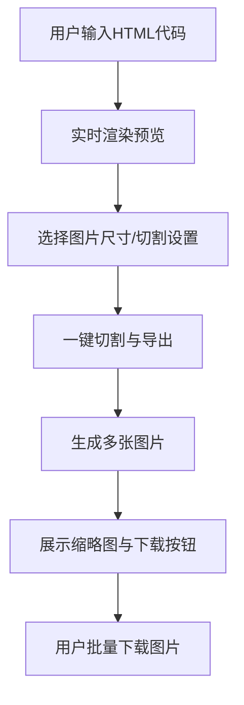

# HTML在线预览与小红书图片切割工具设计文档

## 1. 项目目标

本项目旨在实现一个在线工具，支持用户输入/粘贴HTML代码，实时预览渲染效果，并可一键将预览内容切割成适合小红书图文的图片，支持批量导出。项目将以纯前端实现，便于部署在Cloudflare Pages或GitHub Pages等静态托管平台。

---

## 2. 核心功能

1. **HTML代码输入与实时预览**
   - 支持用户输入、粘贴、编辑HTML代码
   - 实时渲染HTML内容，所见即所得

2. **小红书图片尺寸选择与预览**
   - 预设多种小红书常用图片尺寸（如1080x1440、1080x1920等）
   - 用户可选择目标尺寸，预览切割区域

3. **一键切割与图片导出**
   - 将渲染区域转为图片
   - 按选定尺寸自动切割为多张图片
   - 支持批量导出（如zip打包下载）

4. **安全性与易用性**
   - 对用户输入的HTML进行安全处理，防止XSS等安全风险
   - 简洁直观的界面，支持移动端适配

5. **后续可扩展功能（预留）**
   - 支持Markdown输入
   - 图片水印、模板选择
   - 云端存储与分享

---

## 3. 技术选型

| 模块         | 技术/库         | 说明                                   |
|--------------|-----------------|----------------------------------------|
| 前端框架     | React/Vue/纯JS  | 推荐React，生态丰富，易于组件化开发    |
| 代码编辑器   | Monaco Editor/CodeMirror/textarea | 支持高亮、格式化等功能                |
| HTML渲染     | iframe/dangerouslySetInnerHTML | 沙箱隔离，防止XSS                     |
| 图片生成     | html2canvas/dom-to-image/canvas API | 将DOM转为图片，支持高分辨率           |
| 图片切割     | canvas API      | 按尺寸分割图片                         |
| 批量下载     | jszip           | 多图片打包zip下载                      |
| 样式         | CSS Modules/Scoped CSS | 避免全局样式污染                      |
| 部署         | Cloudflare Pages/GitHub Pages | 静态网站托管                          |

---

## 4. 页面结构设计

### 4.1 页面模块划分

- **顶部导航栏**：项目名称、说明、GitHub链接等
- **主操作区**：
  - 左侧：HTML代码输入区（代码编辑器）
  - 右侧：实时预览区（渲染HTML内容）
- **尺寸与切割设置区**：
  - 选择小红书图片尺寸
  - 预览切割区域
  - 一键切割与导出按钮
- **导出结果区**：
  - 展示已生成的图片缩略图
  - 批量下载按钮

### 4.2 主要UI结构

```
+------------------------------------------------------+
| 顶部导航栏                                           |
+-------------------+-------------------+--------------+
| 代码输入区        | 实时预览区        | 设置与导出区  |
| (左侧)           | (中间)            | (右侧/底部)   |
+-------------------+-------------------+--------------+
| 导出结果区（底部，展示图片缩略图与下载按钮）         |
+------------------------------------------------------+
```

### 4.3 目标图片尺寸默认值

- 默认目标图片尺寸为小红书图文推荐尺寸：**1080 × 1440 像素（3:4，竖图）**。
- 用户可在尺寸选择区切换为其他常用尺寸，如1080 × 1920（9:16，长图）。
- 所有切割与导出操作均以当前选定尺寸为准。

---

## 5. 用户操作流程

1. 用户在左侧输入或粘贴HTML代码
2. 实时预览区自动渲染HTML内容
3. 用户选择目标图片尺寸，预览切割区域
4. 点击“一键切割与导出”按钮
5. 系统将预览内容按指定尺寸切割为多张图片
6. 导出结果区展示所有图片缩略图，用户可批量下载

---

## 6. 主要流程图



---

## 7. 关键技术难点与解决方案

### 7.1 HTML安全渲染
- **难点**：防止用户输入的HTML代码带有恶意脚本（如XSS攻击）。
- **方案**：
  - 使用`iframe`进行沙箱隔离，设置`sandbox`属性，禁止脚本执行。
  - 或在React中使用`dangerouslySetInnerHTML`时，先用库（如`dompurify`）对HTML进行净化。

### 7.2 高质量图片生成与切割
- **难点**：将DOM内容高质量转为图片，并按指定尺寸切割，保证图片清晰度。
- **方案**：
  - 使用`html2canvas`或`dom-to-image`将DOM节点转为canvas，再导出为图片。
  - 切割时用canvas的`drawImage`方法，按尺寸分块导出多张图片。
  - 支持自定义DPR（设备像素比），保证高清导出。

### 7.3 批量导出与打包
- **难点**：多张图片一次性下载，提升用户体验。
- **方案**：
  - 使用`jszip`将所有图片打包为zip文件，提供一键下载。

### 7.4 移动端适配与交互体验
- **难点**：界面在手机端也要易用，操作流畅。
- **方案**：
  - 使用响应式布局（Flex/Grid），按钮、输入区适配触屏操作。
  - 预览区支持手势缩放、拖动。

---

## 8. 扩展建议

- **支持Markdown输入**：自动将Markdown转为HTML，拓展输入方式。
- **模板与样式库**：内置常用图文模板，提升效率。
- **图片水印与LOGO**：支持自定义水印，保护原创。
- **云端存储与分享**：与云盘/社交平台集成，便于分享与备份。
- **多语言支持**：适配不同用户群体。

---

# 设计文档完毕

请确认设计文档内容，如有补充或修改需求请告知，确认无误后可进入开发阶段。 