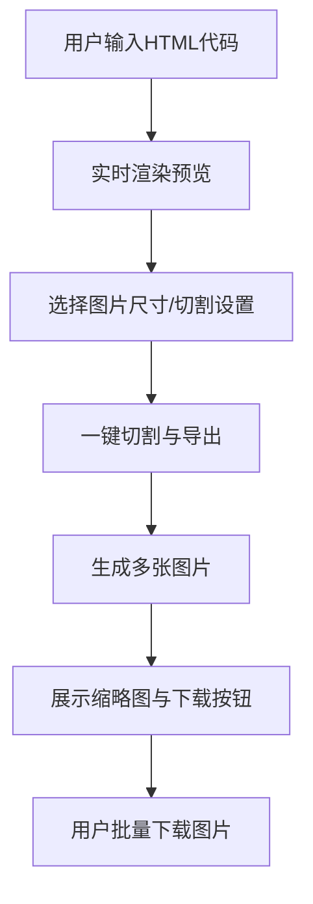

# HTML在线预览与小红书图片切割工具设计文档

## 1. 项目目标

本项目旨在实现一个在线工具，支持用户输入/粘贴HTML代码，实时预览渲染效果，并可一键将预览内容切割成适合小红书图文的图片，支持批量导出。项目将以纯前端实现，便于部署在Cloudflare Pages或GitHub Pages等静态托管平台。

---

## 2. 核心功能

### 测试示例HTML
为方便测试HTML转图片功能，以下是一个典型的小红书图文HTML示例：
```html
<div class="xiaohongshu-post">
  <h2>夏日穿搭灵感 🌞</h2>
  <p>今天分享一套清爽的夏日穿搭，适合25-30℃的天气，共3张细节图</p>
  
  <div class="image-container">
    
  </div>
  <p>图1: 整体搭配效果，简约清爽</p>
  
  <div class="image-container">
    
  </div>
  <p>图2: 白色宽松T恤细节，透气面料</p>
  
  <div class="image-container">
    
  </div>
  <p>图3: 搭配草帽和帆布包，增加夏日感</p>
  
  <p>👕 上衣：白色宽松T恤
  👖 裤子：浅蓝色牛仔短裤
  👟 鞋子：白色帆布鞋</p>
  <p>#夏日穿搭 #OOTD #简约风 #每日穿搭</p>
</div>
```

## 核心功能

1. **HTML代码输入与实时预览**
   - 支持用户输入、粘贴、编辑HTML代码
   - 实时渲染HTML内容，所见即所得

2. **小红书图片尺寸选择与预览**
   - 预设多种小红书常用图片尺寸（如1080x1440、1080x1920等）
   - 用户可选择目标尺寸，预览切割区域

3. **智能内容切割与导出**
   - **内容分析**：解析HTML结构自动识别内容块（标题/段落/图片组）
   - **切割逻辑**：根据内容长度和选定尺寸（3:4/9:16/1:1）计算最优切割数量
   - **尺寸限制**：严格控制单张图片像素（默认宽≤1080px，高≤1920px）
   - **批量导出**：按内容顺序生成图片序列并支持zip打包下载

   - 内容块识别：通过标签类型（p/h2/h3/img）和自定义类名（.content-block）提取页面元素
   - 为每个内容块记录类型、高度和原始HTML内容，用于后续排版计算

4. **安全性与易用性**
   - 对用户输入的HTML进行安全处理，防止XSS等安全风险
   - 简洁直观的界面，支持移动端适配

5. **后续可扩展功能（预留）**
   - 支持Markdown输入
   - 图片水印、模板选择
   - 云端存储与分享

### 2.5 AI生成HTML标准化

#### 2.5.1 输入格式规范

##### 2.5.1.1 AI生成提示词规范
以下是提供给AI生成HTML时的标准提示词模板：
```
请生成符合以下规范的小红书图文HTML：
1. 根容器必须使用<div class="xiaohongshu-container">
2. 标题使用<h2 class="post-title">
3. 正文段落使用<p class="post-content">
4. 图片必须包含alt属性且使用
5. 禁止使用<script>、<iframe>标签
6. 样式必须内联或使用<style>标签（限300行内）
```

##### 2.5.1.2 基础结构要求
**强制标准**：
- 根容器必须包含`data-ai-generated="true"`属性，用于系统识别
- 图片必须使用绝对URL，且包含`loading="lazy"`延迟加载属性
- 文本内容需包含`lang`属性（如`lang="zh-CN"`）
- 禁止使用JavaScript代码（`<script>`, `on*`事件属性）

**推荐结构**：
```html
<div class="ai-generated-content" data-ai-version="1.0">
  <h2 lang="zh-CN">内容标题</h2>
  <p lang="zh-CN">正文内容段落，建议不超过150字/段</p>
  <figure>
    
    <figcaption>图片说明文字</figcaption>
  </figure>
  <div class="tags">#话题标签1 #话题标签2</div>
</div>
```

#### 2.5.2 验证与修复机制

##### 2.5.2.1 图片数量识别算法
（基于AI提示词定义的容器规则）
1. **容器识别标准**
   - 严格以`div class="xiaohongshu-container"`作为单张图片的判断依据
   - 每个符合标准的容器对应生成一张独立图片

2. **数量计算方式**
   - 统计HTML中所有带有该类名的顶级容器数量
   - 直接映射为最终图片数量（N个容器→N张图片）

3. **容器验证规则**
   - 必须包含至少一个内容元素（图片/文本）
   - 宽高比需符合选定尺寸（3:4/9:16/1:1）
   - 嵌套容器不重复计数（仅识别顶级容器）

##### 2.5.2.2 核心标签验证
**自动化验证流程**：
1. **结构验证**：使用HTML5验证器检查标签嵌套合法性
2. **安全过滤**：通过DOMPurify移除危险元素（`iframe`, `svg:script`等）
3. **语义检查**：确保标题层级（h2-h4）连续，无跳跃
4. **资源校验**：验证图片URL可达性，替换无效链接为占位图

**修复示例**：
| 问题类型 | 检测规则 | 自动修复方案 |
|----------|----------|--------------|
| 缺少alt属性 | `img:not([alt])` | 添加`alt="自动生成描述"` |
| 内联样式过长 | `style[length]>500` | 提取关键样式，移除冗余属性 |
| 文本溢出 | `p:not(:has(br)):length>300` | 自动插入`<br>`分段 |

<!-- 性能优化章节暂不实现，待基础功能稳定后再考虑 -->
- **解析加速**：
  - 采用增量解析策略，优先处理标题、图片和段落等关键节点，提高大型文档处理效率

- **缓存策略**：
  - 验证规则缓存：使用Map存储CSS选择器验证结果，TTL=1小时
  - 修复方案缓存：LRU缓存最近100条修复记录，内存限制5MB
  - 预编译正则：将常用验证规则编译为RegExp对象，避免重复编译

- **Web Worker实现**：
  - 使用Web Worker进行HTML验证和净化处理，避免主线程阻塞

- 变量：元素位置(x,y)、尺寸(w,h)、优先级(p)
- 约束条件：目标尺寸比例、元素最小显示面积、内容完整性
- 目标函数：最大化关键内容可见性(权重：标题0.8，图片0.7，正文0.3)

**布局策略矩阵**：
| 尺寸规格 | 容器宽高 | 边距 | 字体大小 | 图片处理 |
|----------|----------|------|----------|----------|
| 3:4(竖版) | 600×800px | 16px | 标题24px/正文16px | 单图占比80%容器宽 |
| 9:16(全屏) | 414×736px | 12px | 标题20px/正文14px | 单图占比90%容器宽 |
| 1:1(正方形) | 600×600px | 20px | 标题28px/正文18px | 多图网格布局(2×2) |

#### 2.6.2 内容智能拆分算法
**分页逻辑**：
1. **内容块划分**：将HTML按语义拆分为不可分割单元（标题+段落+图片组合）
2. **尺寸预计算**：使用`getBoundingClientRect()`预估每个单元渲染高度
3. **贪婪分页算法**：
   ```pseudocode
   currentPageHeight = 0
   for each block in contentBlocks:
     if currentPageHeight + block.height > targetHeight:
       createNewPage()
       currentPageHeight = 0
     addBlockToPage(block)
     currentPageHeight += block.height + margin
   ```
4. **边界调整**：确保图片不跨页，标题不单独在页尾

#### 2.6.3 响应式样式系统
**动态样式生成规则**：
- 使用CSS变量定义基础样式：`--base-font-size: 16px; --spacing-unit: 8px`
- 媒体查询适配不同尺寸：
  ```css
  @media (aspect-ratio: 3/4) {
    :root { --base-font-size: 16px; }
  }
  @media (aspect-ratio: 9/16) {
    :root { --base-font-size: 14px; }
  }
  ```
- 元素自适应公式：`width: calc(var(--container-width) * 0.9);`

#### 2.6.4 实现流程图
```
┌──────────────┐    ┌──────────────┐    ┌──────────────┐
│  HTML解析器  │───▶│ 内容块提取器 │───▶│ 尺寸预计算   │
└──────────────┘    └──────────────┘    └──────┬───────┘
                                                │
┌──────────────┐    ┌──────────────┐    ┌──────▼───────┐
│ 渲染结果输出 │◀───│ CSS生成器    │◀───│ 布局引擎     │
└──────────────┘    └──────────────┘    └──────────────┘
```

#### 2.6.5 冲突解决策略
当内容尺寸与目标尺寸冲突时的优先级处理：
1. **完整性优先**：确保标题和图片完整显示，允许文字截断（末尾添加"..."）
2. **比例优先**：图片保持原始比例，通过留白或裁剪边缘处理
3. **关键信息优先**：使用TextRank算法提取关键词，确保关键词在可视区域

#### 2.6.6 测试用例
| 测试场景 | 输入特征 | 预期输出 |
|----------|----------|----------|
| 超长文本 | 5000字连续文本，无分段 | 自动拆分为12个3:4尺寸页面，关键词密度>5% |
| 多图布局 | 6张不等高图片 | 自动排列为2×3网格，高宽比误差<5% |
| 混合内容 | 标题+表格+代码块+图片 | 表格转为卡片式布局，代码块使用等宽字体 |

#### 2.6.7 性能指标
- **核心指标**：
  | 指标 | 目标值 | 测量工具 |
  |------|--------|----------|
  | 首次内容绘制(FCP) | <1.5s | Lighthouse |
  | 布局偏移率(CLS) | <0.1 | Web Vitals |
  | 最大内容绘制(LCP) | <2.5s | Performance API |

- **优化手段**：
  1. 使用requestAnimationFrame批量处理DOM更新
  2. 图片采用WebP格式，预计算尺寸避免重排
  3. 布局计算结果缓存，相同内容复用计算结果

<!-- 跨模块集成章节暂不实现，聚焦核心功能 -->
**与核心功能模块交互**：
```
┌─────────────────┐      ┌─────────────────┐
│  AI标准化模块   │─────▶│  实时预览模块   │
└─────────────────┘      └────────┬────────┘
                                  │
┌─────────────────┐      ┌────────▼────────┐
│  导出模块       │◀─────│ 智能排版模块    │
└─────────────────┘      └─────────────────┘
```

**数据交互协议**：
```typescript
interface StandardizedContent {
  html: string;
  metadata: {
    version: string;
    wordCount: number;
    imageCount: number;
    issues: Array<{code: string; message: string}>;
  };
  stats: {
    parseTime: number;
    fixCount: number;
  };
}
```

#### 2.6.9 扩展测试用例
**边界场景测试**：
| 场景 | 输入描述 | 预期行为 |
|------|----------|----------|
| 极端窄屏 | 宽度<320px的设备 | 自动切换单列布局，字体缩小至12px |
| 超长标题 | 80字无空格标题 | 自动换行+省略号，保留前50字 |
| 空白内容 | 仅包含空格和换行 | 显示"无内容"提示，禁用导出按钮 |
| 重复元素 | 100张相同图片 | 去重处理，仅保留3张并提示用户 |
- 布局计算耗时：<300ms（内容<10000字）
- 内存占用：<200MB（10张图片处理）
- 重排率：<5次/页面（Chrome Performance检测）
```
┌──────────────┐    ┌──────────────┐    ┌──────────────┐
│  HTML解析器  │───▶│ 内容块提取器 │───▶│ 尺寸预计算   │
└──────────────┘    └──────────────┘    └──────┬───────┘
                                                │
┌──────────────┐    ┌──────────────┐    ┌──────▼───────┐
│ 渲染结果输出 │◀───│ CSS生成器    │◀───│ 布局引擎     │
└──────────────┘    └──────────────┘    └──────────────┘
```

#### 2.5.1 输入格式规范
| 元素类型 | 要求 | 示例 |
|----------|------|------|
| 根容器 | 必须包含class="ai-generated-content" | `<div class="ai-generated-content">...</div>` |
| 图片元素 | 必须包含alt属性，宽度不超过600px | `` |
| 文本层级 | 使用h2-h4标题，p标签正文，禁止使用h1 | `<h2>主标题</h2><p>正文内容</p>` |
| 样式限制 | 仅允许内联样式，禁止使用<style>标签和@import | `<p style="color:#333;margin:10px 0">文本</p>` |

#### 2.5.2 验证机制
1. HTML结构验证：使用HTML5 DOCTYPE和语义化标签
2. 样式合规性检查：过滤危险CSS属性（如position:fixed）
3. 内容完整性校验：确保包含至少一个图片和30字以上文本

#### 2.5.3 错误处理
- 不合规内容自动标记：`<span class="invalid-content">[无效内容]</span>`
- 修复建议生成：提供具体修改指引
- 降级渲染策略：保留核心内容，忽略违规部分

### 2.6 智能排版适配

#### 2.6.1 多尺寸自适应算法
1. **内容优先级排序**
   - 标题 > 图片 > 正文 > 标签
   - 使用TF-IDF算法提取关键词，确保关键信息优先展示

2. **布局调整策略**
| 目标尺寸 | 布局方式 | 元素处理 |
|----------|----------|----------|
| 3:4(竖版) | 单列流式布局 | 图片宽度100%，文字居中 |
| 9:16(全屏) | 卡片式布局 | 标题固定顶部，内容滚动 |
| 1:1(正方形) | 网格布局 | 多图自动排列2x2网格 |

#### 2.6.2 实现方案
- 使用Intersection Observer监测元素可见性
- 结合ResizeObserver实现动态调整
- 采用CSS Grid+Flexbox混合布局系统
- 文本自动缩放算法：`clamp(min-size, ratio, max-size)`

#### 2.6.3 质量评估指标
- 内容完整度 > 95%
- 视觉舒适度评分 > 4.5/5
- 加载性能：首次内容绘制 < 2s

---

## 3. 技术选型

| 模块         | 技术/库         | 说明                                   |
|--------------|-----------------|----------------------------------------|
| 前端框架     | React/Vue/纯JS  | 推荐React，生态丰富，易于组件化开发    |
| 代码编辑器   | Monaco Editor/CodeMirror/textarea | 支持高亮、格式化等功能                |
| HTML渲染     | iframe/dangerouslySetInnerHTML | 沙箱隔离，防止XSS                     |
| 图片生成     | html2canvas/dom-to-image/canvas API | 将DOM转为图片，支持高分辨率           |
| 图片切割     | canvas API      | 按尺寸分割图片                         |
| 批量下载     | jszip           | 多图片打包zip下载                      |
| 样式         | CSS Modules/Scoped CSS | 避免全局样式污染                      |
| 部署         | Cloudflare Pages/GitHub Pages | 静态网站托管                          |

---

## 4. 页面结构设计

### 4.1 页面模块划分

- **顶部导航栏**：项目名称、说明、GitHub链接等
- **主操作区**：
  - 左侧：HTML代码输入区（代码编辑器）
  - 右侧：实时预览区（渲染HTML内容）
- **尺寸与切割设置区**：
  - 选择小红书图片尺寸
  - 预览切割区域
  - 一键切割与导出按钮
- **导出结果区**：
  - 展示已生成的图片缩略图
  - 批量下载按钮

### 4.2 主要UI结构

```
+------------------------------------------------------+
| 顶部导航栏                                           |
+-------------------+-------------------+--------------+
| 代码输入区        | 实时预览区        | 设置与导出区  |
| (左侧)           | (中间)            | (右侧/底部)   |
+-------------------+-------------------+--------------+
| 导出结果区（底部，展示图片缩略图与下载按钮）         |
+------------------------------------------------------+
```

### 4.3 目标图片尺寸默认值

- 默认目标图片尺寸为小红书图文推荐尺寸：**1080 × 1440 像素（3:4，竖图）**。
- 用户可在尺寸选择区切换为其他常用尺寸，如1080 × 1920（9:16，长图）。
- 所有切割与导出操作均以当前选定尺寸为准。

---

## 5. 用户操作流程

1. 用户在左侧输入或粘贴HTML代码
2. 实时预览区自动渲染HTML内容
3. 用户选择目标图片尺寸，预览切割区域
4. 点击“一键切割与导出”按钮
5. 系统将预览内容按指定尺寸切割为多张图片
6. 导出结果区展示所有图片缩略图，用户可批量下载

---

## 6. 主要流程图



---

## 7. 关键技术难点与解决方案

### 7.1 HTML安全渲染
- **难点**：防止用户输入的HTML代码带有恶意脚本（如XSS攻击）。
- **方案**：
  - 使用`iframe`进行沙箱隔离，设置`sandbox`属性，禁止脚本执行。
  - 或在React中使用`dangerouslySetInnerHTML`时，先用库（如`dompurify`）对HTML进行净化。

### 7.2 高质量图片生成与切割
- **难点**：将DOM内容高质量转为图片，并按指定尺寸切割，保证图片清晰度。
- **方案**：
  - 使用`html2canvas`或`dom-to-image`将DOM节点转为canvas，再导出为图片。
  - 切割时用canvas的`drawImage`方法，按尺寸分块导出多张图片。
  - 支持自定义DPR（设备像素比），保证高清导出。

### 7.3 批量导出与打包
- **难点**：多张图片一次性下载，提升用户体验。
- **方案**：
  - 使用`jszip`将所有图片打包为zip文件，提供一键下载。

### 7.4 移动端适配与交互体验
- **难点**：界面在手机端也要易用，操作流畅。
- **方案**：
  - 使用响应式布局（Flex/Grid），按钮、输入区适配触屏操作。
  - 预览区支持手势缩放、拖动。

---

## 8. 扩展建议

- **支持Markdown输入**：自动将Markdown转为HTML，拓展输入方式。
- **模板与样式库**：内置常用图文模板，提升效率。
- **图片水印与LOGO**：支持自定义水印，保护原创。
- **云端存储与分享**：与云盘/社交平台集成，便于分享与备份。
- **多语言支持**：适配不同用户群体。

---

# 设计文档完毕

请确认设计文档内容，如有补充或修改需求请告知，确认无误后可进入开发阶段。